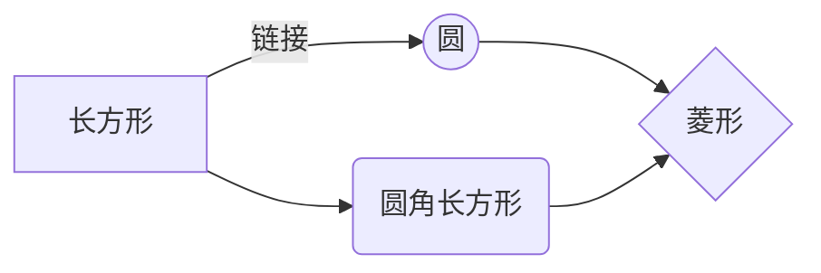
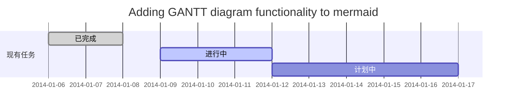

# word-train
## Word培训
### 1、什么是word
 - office与WPS的区别
*[HTML]:   WPS：小巧，免费，中文支持化好，插件很多，稳定性欠佳;OFFICE：功能上比WPS要强大，所需空间大，资源占用上也比较大，但稳定性好，大文件处理速度有明显优势两者基本大同小异，文件方面常用格式可以完美兼容。所以如果你会使用wps的话，微软office操作也完全没有问题的。
 - 界面认识：页边距、纸张大小、分页符、
 - 常用快捷键：zxcvbnasf

 - 审阅、批注、比较
 - 插入附件
 - 打印、输出、保存字体
### 2、文字
 - 字体、字号、字符间距
 - 拼音、带圈字符、艺术字
 - 格式刷

### 3、段落
 - 对齐、项目符号和编号、缩进、间距
 - 制表位
 - 大纲

### 4、图片
 - 环绕方式、设置透明色、叠放顺序
### 5、公文格式
公示、通知、申请等
### 6、论文排版
 - 表格排版、题注、尾注、脚注、交叉引用
 - 封面、页眉、页脚

### 7、宣传单页
 - 邮件
### 8、其他文本编辑工具
#### 1、Markdown
#### 2、Latex

Gamma公式展示 $\Gamma(n) = (n-1)!\quad\forall
n\in\mathbb N$ 是通过 Euler integral

$$
\Gamma(z) = \int_0^\infty t^{z-1}e^{-t}dt\,.
$$
#### 3、Mermaid

#### 4、GANTT

